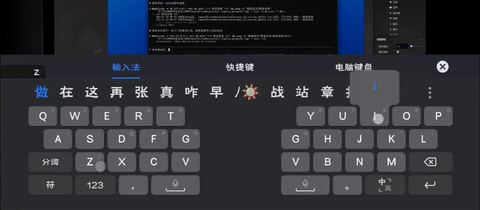
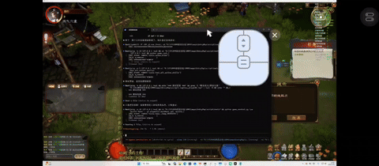

# Y3 Game Test Skill

> by Y3海豹

Y3（英雄三国，KK对战平台游戏）游戏热更新与测试调试工具。通过计划任务实现**无UAC弹窗**启动游戏，支持热更新和远程执行 Lua 代码。

**🎯 支持无人值守自动对某个模块进行不断的调试优化迭代！**

## 🎬 效果演示

<p align="center">
  
  
</p>

## 适用人群

- 🚀 Y3 地图编辑器 Lua 作者

## 核心功能

- 🚀 **启动/关闭/重启/暂停游戏** - 通过计划任务启动，无UAC弹窗
- 🔄 **热更新** - 实时更新 Lua 代码无需重启，随时修改代码并应用
- 📝 **执行 Lua** - 远程执行任意 Lua 代码，支持自动打断点分析
- 🔧 **调试工具** - 内置调试脚本模板
- 🔍 **异常捕获** - 自动捕获引擎级异常，写入消息文件供监听

## 💡 使用建议

想要完美使用，需要你不断迭代更新自己的 tools。这里仅提供一些案例，主要是方便控制的热更新代码，比如：
- 在选择界面帮你自动选角色
- 自动刷兵
- 刷全部技能测伤害和 bug

## 安装

### 方法 1：让 Claude Code 自动安装（推荐）

1. **克隆仓库到项目 skills 目录：**

```bash
cd <你的Y3项目>/maps/<地图>/script/.claude/skills
git clone https://github.com/pirronewantlux529-coder/y3autohotfreshskill.git y3-game-test
```

2. **复制 tools 目录到项目 script 目录：**

```bash
cp -r y3-game-test/tools ../../tools
```

3. **让 Claude Code 完成配置：**

直接告诉 Claude Code：

```
请阅读 .claude/skills/y3-game-test/Y3_HELPER_SETUP.md 并帮我完成安装配置
```

Claude 会自动：

- 修改 Y3 Helper 插件（添加 runLua 命令）
- 检查并配置 main.lua 和 debugs.lua
- 创建计划任务（无UAC启动）
- 验证安装

### 🎉 自动配置（无需手动设置路径！）

**所有路径自动从项目文件检测，无需手动配置：**

| 配置项 | 自动读取位置 |
|--------|-------------|
| 游戏可执行文件 | `.vscode/settings.json` → `Y3-Helper.EditorPath` |
| 关卡 ID | `header.project` → `entry_map.id` |
| 项目路径 | 从 `tools` 目录位置自动推断 |

**验证配置：**
```bash
cd <项目>/script/tools
python game_control.py config
```

### 方法 2：手动安装

参见 [Y3_HELPER_SETUP.md](Y3_HELPER_SETUP.md) 的详细步骤。

## 使用

### 命令行

```bash
# 启动游戏（无UAC弹窗）
python game_control.py launch

# 启动游戏（通过Y3 Helper，会弹UAC）
python game_control.py launch2

# 热更新
python game_control.py reload

# 快速进入游戏
python game_control.py enter

# 重启游戏（游戏内切换关卡，卡死时无效）
python game_control.py restart

# 强制杀游戏进程（只杀游戏，不杀编辑器）
python game_control.py kill

# 强制重启（杀进程 → 启动 → 进入游戏）
python game_control.py frestart

# 执行 Lua 代码
python game_control.py lua "print('Hello!')"

# 执行测试脚本
python game_control.py run debug_template

# 简单打印测试
python game_control.py test

# 启动错误监听器（新窗口）
python game_control.py listen

# 在游戏中启用错误发送
python game_control.py errors
```

> **首次使用前必须创建计划任务**（以管理员身份运行）：
> - `setup_launch_task.bat` - 创建启动游戏任务（无UAC弹窗启动）
> - `setup_kill_task.bat` - 创建杀进程任务（强制杀游戏进程）
>
> 不创建也能用，但会弹UAC确认框。

### Claude Code

安装完成后，直接告诉 Claude：

```
启动游戏
热更新代码
执行测试脚本 xxx
```

Claude 会自动调用相关命令。

## 文件结构

```
y3-game-test/
├── SKILL.md                    # Skill 使用说明（Claude 读取）
├── Y3_HELPER_SETUP.md          # 安装配置指南（Claude 自动安装用）
├── README.md                   # 本文件
├── tools/
│   ├── game_control.py         # 游戏控制脚本
│   ├── install_y3helper_runlua.py  # 插件安装脚本
│   ├── launch_game.bat.template    # 启动脚本模板
│   ├── quick_enter.lua         # 快速进入游戏
│   ├── restart_game.lua        # 重启游戏
│   └── debug_template.lua      # 调试模板
└── examples/
    ├── debugs_y3helper_patch.lua   # debugs.lua 补丁
    ├── y3helper_client.py          # Python 客户端库
    └── example_test.py             # 使用示例
```

## 前提条件

- Cursor 或 VSCode
- **Y3 Helper 插件 (Y3小助手)** - 必须安装，否则无法使用。请自行查询 Y3 Helper 的安装方法
- Python 3.x

## ⚠️ 注意事项

1. **必须安装 Y3 Helper 插件** - 核心功能需要对 Y3 Helper 打补丁，插件更新后需重新打补丁
2. **必须先启动 VSCode/Cursor** - Y3 Helper 插件在代码编辑器中运行（不是游戏编辑器）
3. **不要直接启动游戏 exe** - 会闪退，必须通过计划任务或 Y3 Helper

## 更新

```bash
cd <你的Y3项目>/maps/<地图>/script/.claude/skills/y3-game-test
git pull
```

Y3 Helper 插件更新后需要重新运行 `install_y3helper_runlua.py`。

## License

MIT
